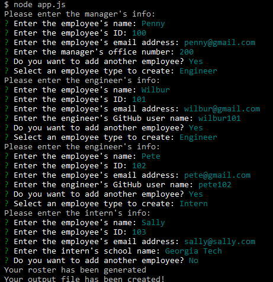
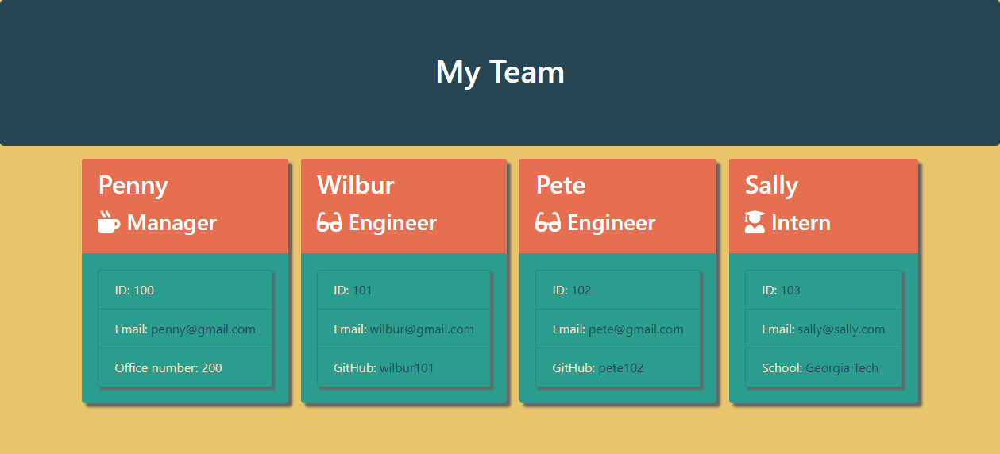

# team-roster-generator
A command line application that takes user input and generates an HTML document containing roster information for a software engineering team

## Description
This project generates an HTML page containing a roster for a software engineering team.  The application is written using JavaScript and should be run using the Node.js JavaScript runtime environment.  The Bootstrap CSS framework was used for styling the HTML document.  The node package manager inquirer package is used to provide a command line interface for the application, and the jest package is used to validate classes.

### Features
* Inquirer command-line interface
* Data validation for email and ID inputs
* Generated HTML page with custom styling 

[Link to the repository](https://github.com/pkriengsiri/team-roster-generator)
  
## Table of Contents
* [Installation](#installation)
* [Usage](#usage)
* [Credits](#credits)
* [License](#license)
* [Contributing](#contributing)
* [Tests](#tests)
* [Questions](#questions)
  
## Installation
From GitHub, fork the repo all upload all contents to the deployed webserver.  The server must have Node.js installed.  Once forked, run `npm i` from the root directory to install required dependencies.
  
## Usage
From the application's root directory, run `node app.js`.  Follow the user prompts to provide information about each employee in the software engineering team.  Upon completion, the application will generate a new `team.html`, in the `./output` directory




[Link to video demo](https://drive.google.com/file/d/1wWZ0rFmzrbEf7Ru10aj6L-_SapE1Lf_v/view)
  
## Credits
Collaborators on this project included instructional staff, TAs, and students in the Georgia Tech Coding Boot Camp Winter 2020 cohort.

### References
* https://regexlib.com/REDetails.aspx?regexp_id=26


## License
This application is covered under MIT License

<details>
  <summary>
    License Text
  </summary> 

```

Copyright (c) 2021  Pete Kriengsiri

Permission is hereby granted, free of charge, to any person obtaining a copy
of this software and associated documentation files (the "Software"), to deal
in the Software without restriction, including without limitation the rights
to use, copy, modify, merge, publish, distribute, sublicense, and/or sell
copies of the Software, and to permit persons to whom the Software is
furnished to do so, subject to the following conditions:
      
The above copyright notice and this permission notice shall be included in all
copies or substantial portions of the Software.
      
THE SOFTWARE IS PROVIDED "AS IS", WITHOUT WARRANTY OF ANY KIND, EXPRESS OR
IMPLIED, INCLUDING BUT NOT LIMITED TO THE WARRANTIES OF MERCHANTABILITY,
FITNESS FOR A PARTICULAR PURPOSE AND NONINFRINGEMENT. IN NO EVENT SHALL THE
AUTHORS OR COPYRIGHT HOLDERS BE LIABLE FOR ANY CLAIM, DAMAGES OR OTHER
LIABILITY, WHETHER IN AN ACTION OF CONTRACT, TORT OR OTHERWISE, ARISING FROM,
OUT OF OR IN CONNECTION WITH THE SOFTWARE OR THE USE OR OTHER DEALINGS IN THE
SOFTWARE.

```
</details>


## Contributing
No contributions are being accepted at this time.
  
## Badges
[](https://github.com/pkriengsiri/team-roster-generator/blob/main/LICENSE)
[](https://github.com/pkriengsiri/team-roster-generator/issues)
[](https://github.com/pkriengsiri/team-roster-generator/stargazers)

## Tests
Run `npm test` to run tests via the npm jest package.

## Questions
Contact me via [email](mailto:pkriengsiri@gmail.com).
View my GitHub [profile](https://github.com/pkriengsiri).

